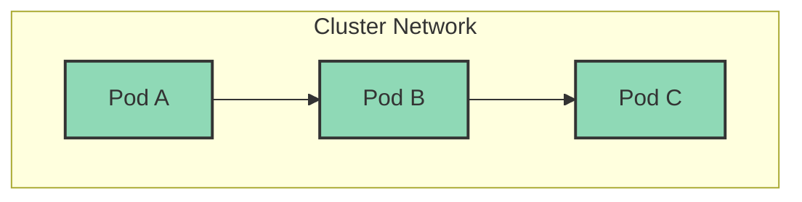
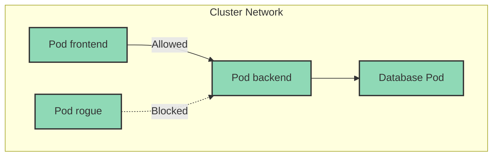
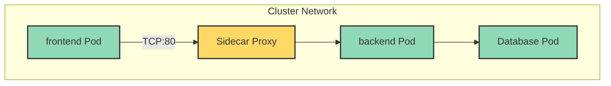
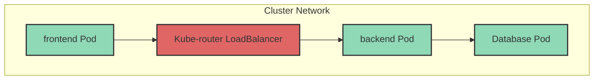
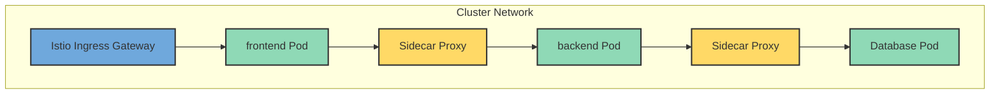

# Kubernetes 网络指南

本指南涵盖 Kubernetes 网络方案、官方文档、安装步骤、使用场景以及快速部署 YAML 示例。

---

[TOC]

# Kubernetes 网络基础模型

- Pod 网络（CNI）：Pod 间互通
- Service 网络：ClusterIP / NodePort / LoadBalancer
- Ingress / Gateway：HTTP/HTTPS 外部入口
- Service Mesh：应用层治理与可观测性

# 1. Flannel

> Pod 之间通过 Flannel 提供的 Overlay 网络直接通信。



- 官方文档: https://github.com/flannel-io/flannel
- 使用场景: 轻量级集群，简单网络通信，适合小型生产和开发环境
- 快速安装:

```bash
kubectl apply -f https://raw.githubusercontent.com/flannel-io/flannel/master/Documentation/kube-flannel.yml
```

- Pod 网络示例:

```yaml
apiVersion: v1
kind: Pod
metadata:
  name: flannel-demo
spec:
  containers:
    - name: app
      image: busybox
      command: ["sh", "-c", "sleep 3600"]
```

# 2. Calico



> Calico 可以阻止不符合策略的 Pod 访问后端。

- 官方文档: https://projectcalico.docs.tigera.io/

- 使用场景: 支持网络策略、企业级安全隔离、高可用集群
- 快速安装:

```bash
kubectl apply -f https://raw.githubusercontent.com/projectcalico/calico/v3.27.0/manifests/calico.yaml
```

- 网络策略示例:

```yaml
apiVersion: projectcalico.org/v3
kind: NetworkPolicy
metadata:
  name: allow-nginx
  namespace: default
spec:
  selector: app == 'nginx'
  ingress:
    - action: Allow
      protocol: TCP
      destination:
        ports: [80]
```

# 3. Cilium

> 所有 Pod 流量可以通过 eBPF Sidecar 或 NetworkPolicy 控制。



- 官方文档: https://cilium.io/
- 使用场景: 支持高性能网络、eBPF 功能、安全策略、服务可观测性
- 快速安装:

```bash
helm repo add cilium https://helm.cilium.io/
helm install cilium cilium/cilium --namespace kube-system --set kubeProxyReplacement=strict --set k8sServiceHost=<API_SERVER> --set k8sServicePort=6443
```

- 网络策略示例:

```yaml
apiVersion: cilium.io/v2
kind: CiliumNetworkPolicy
metadata:
  name: allow-http
spec:
  endpointSelector:
    matchLabels:
      app: web
  ingress:
    - fromEndpoints:
        - matchLabels:
            role: frontend
      toPorts:
        - ports:
            - port: "80"
              protocol: TCP
```

# 4. Weave Net

> Weave Net 自动为多主机 Pod 创建虚拟网络，Pod 间直接互通。


- 官方文档: https://www.weave.works/docs/net/latest/
- 使用场景: 易部署、支持多主机容器互联、适合开发和小型生产
- 快速安装:

```bash
kubectl apply -f https://github.com/weaveworks/weave/releases/latest/download/weave-daemonset-k8s.yaml
```

- Pod 示例:

```yaml
apiVersion: v1
kind: Pod
metadata:
  name: weave-demo
spec:
  containers:
    - name: app
      image: busybox
      command: ["sh", "-c", "sleep 3600"]
```

# 5. Kube-router

> Pod 通过 Kube-router 的 LoadBalancer 进行流量分发.



- 官方文档: https://github.com/cloudnativelabs/kube-router
- 使用场景: 提供路由、网络策略和负载均衡一体化，适合中大型集群
- 快速安装:

```bash
kubectl apply -f https://raw.githubusercontent.com/cloudnativelabs/kube-router/master/daemonset/kube-router.yaml
```

# 6. Istio — Service Mesh

> Istio 服务网格通过 Ingress Gateway 和 Sidecar 代理控制流量.



- 官方文档: https://istio.io/
- 使用场景: 微服务流量管理、可观测性、安全策略、服务治理
- 快速安装:

```bash
istioctl install --set profile=demo -y
```

- Ingress 网关示例:

```yaml
apiVersion: networking.istio.io/v1beta1
kind: Gateway
metadata:
  name: istio-demo-gateway
spec:
  selector:
    istio: ingressgateway
  servers:
  - port:
      number: 80
      name: http
      protocol: HTTP
    hosts:
    - "*"
```

# 7. Ingress Controller

> 外部客户端通过 Ingress Controller 访问后端 Pod 服务。


- Nginx 官网: https://kubernetes.github.io/ingress-nginx/
- 使用场景: HTTP/HTTPS 外部流量入口、负载均衡、TLS 终止
- 快速安装:

```bash
kubectl apply -f https://raw.githubusercontent.com/kubernetes/ingress-nginx/main/deploy/static/provider/cloud/deploy.yaml
```

- Ingress 示例:

```yaml
apiVersion: networking.k8s.io/v1
kind: Ingress
metadata:
  name: example-ingress
spec:
  rules:
    - host: example.local
      http:
        paths:
        - path: /
          pathType: Prefix
          backend:
            service:
              name: my-service
              port:
                number: 80
```

# 8. MetalLB

> 外部客户端通过 MetalLB LoadBalancer 访问集群内 Pod 服务。


- 官方文档: https://metallb.universe.tf/
- 使用场景: 为裸机 Kubernetes 提供 LoadBalancer 类型服务、支持 L2 或 BGP
- 快速安装 L2 模式:

```bash
kubectl apply -f https://raw.githubusercontent.com/metallb/metallb/v0.14.3/config/manifests/metallb.yaml
kubectl apply -f metallb-config.yaml # 配置地址池
```

- 地址池配置:

```yaml
apiVersion: v1
kind: ConfigMap
metadata:
  namespace: metallb-system
  name: config
data:
  config: |
    address-pools:
    - name: default
      protocol: layer2
      addresses:
      - 192.168.1.240-192.168.1.250
```

- Service 示例:

```yaml
apiVersion: v1
kind: Service
metadata:
  name: metallb-demo
spec:
  type: LoadBalancer
  selector:
    app: my-app
  ports:
    - protocol: TCP
      port: 80
      targetPort: 80
```

